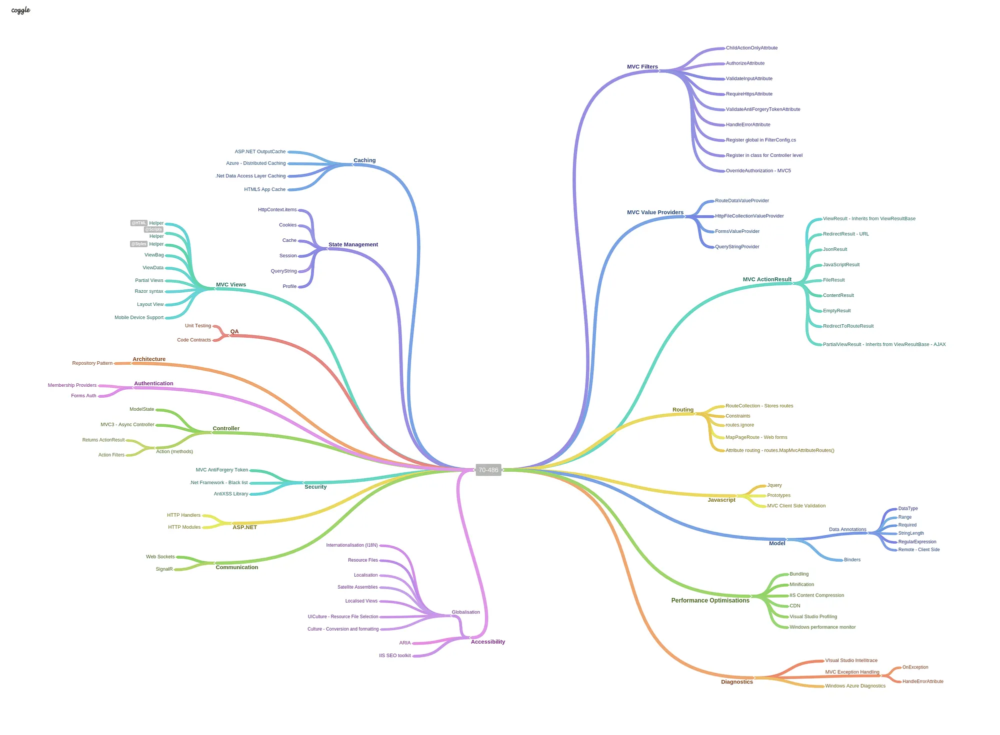
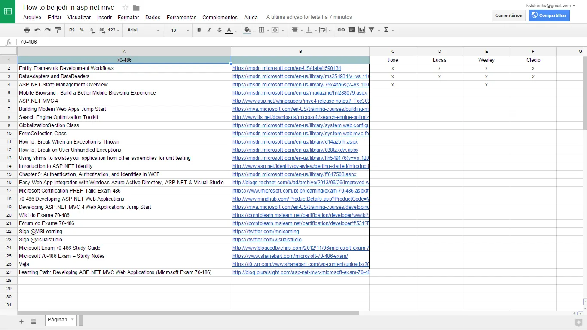

:::important[Update — May 2026]
Exam 70-486 has long been retired. Its successor, AZ-204, also retires on **July 31, 2026** and is replaced by **AI-200 (Azure AI Cloud Developer Associate)**. For the current path, see [From 70-486 to AI-200: a Microsoft cert lineage](/posts/microsoft-ai-200).
:::

Hi everyone. I recently started studying for Microsoft's [70-486 Developing ASP.NET MVC Web Applications](https://www.microsoft.com/en-us/learning/exam-70-486.aspx) certification, a requirement to become a Microsoft Certified Solutions Developer ([MCSD Web Applications](https://www.microsoft.com/en-us/learning/mcsd-web-apps-certification.aspx)).

The passing score is **700**. The exam runs for **120 minutes** and has between **45 and 60** multiple-choice and drag-and-drop questions. It also includes a few "real-world" scenario simulations — the well-known "case studies" — covering technical and business requirements.

Some say 70-486 is the toughest exam on the MCSD track. To prepare, I've been studying around 5 hours a week.

I've shared my [**study spreadsheet**](https://docs.google.com/spreadsheets/d/1JikZ2gJOfcuooKAmqzlEvt09r8b-VG9TbpKfQjgjw6w/edit?usp=sharing) with the topics required by the exam. If you're also planning to take this certification, the spreadsheet is a good starting point — and if you have friends preparing too, you can invite them and make it a collaborative effort.

## Collaborative spreadsheet

For easier access, I'm also listing the spreadsheet links here so you can bookmark this post and find them quickly.

- [Entity Framework Development Workflows](https://msdn.microsoft.com/en-US/data/jj590134)
- [DataAdapters and DataReaders](https://msdn.microsoft.com/en-us/library/ms254931%28v=vs.110%29.aspx)
- [ASP.NET State Management Overview](https://msdn.microsoft.com/en-us/library/75x4ha6s%28v=vs.100%29.aspx)
- [Mobile Browsing — Build a Better Mobile Browsing Experience](https://msdn.microsoft.com/en-us/magazine/hh288079.aspx)
- [ASP.NET MVC 4](http://www.asp.net/whitepapers/mvc4-release-notes#_Toc303253810)
- [Building Modern Web Apps Jump Start](https://mva.microsoft.com/en-US/training-courses/building-modern-web-apps-jump-start-8524?l=iAMWgimz_4004984382)
- [Search Engine Optimization Toolkit](http://www.iis.net/downloads/microsoft/search-engine-optimization-toolkit)
- [GlobalizationSection Class](https://msdn.microsoft.com/en-us/library/system.web.configuration.globalizationsection.aspx)
- [FormCollection Class](https://msdn.microsoft.com/en-us/library/system.web.mvc.formcollection%28v=vs.118%29.aspx)
- [How to: Break When an Exception is Thrown](https://msdn.microsoft.com/en-us/library/d14azbfh.aspx)
- [How to: Break on User-Unhandled Exceptions](https://msdn.microsoft.com/en-us/library/038tzxdw.aspx)
- [Introduction to ASP.NET Identity](http://www.asp.net/identity/overview/getting-started/introduction-to-aspnet-identity)
- [Authentication, Authorization, and Identities in WCF](https://msdn.microsoft.com/en-us/library/ff647503.aspx)
- [Easy Web App Integration with Windows Azure Active Directory, ASP.NET & Visual Studio](http://blogs.technet.com/b/ad/archive/2013/06/26/improved-windows-azure-active-directory-integration-with-asp-net-amp-visual-studio.aspx)
- [Microsoft Certification PREP Talk: Exam 486](https://www.microsoft.com/pt-br/learning/exam-70-486.aspx#video)
- [Developing ASP.NET MVC 4 Web Applications Jump Start](https://mva.microsoft.com/en-US/training-courses/developing-asp-net-mvc-4-web-applications-jump-start-8239?l=fwYCcoJy_2404984382)
- [Learning Path: Developing ASP.NET MVC Web Applications (Microsoft Exam 70-486)](http://blog.pluralsight.com/asp-net-mvc-microsoft-exam-70-486)

The exam covers a wide range of topics, so if you're going for this certification, study hard and make sure you're comfortable with everything on the syllabus.

Good luck, and happy studying!
